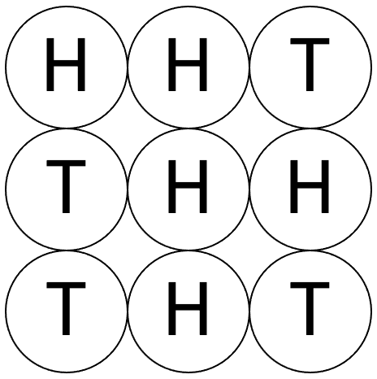
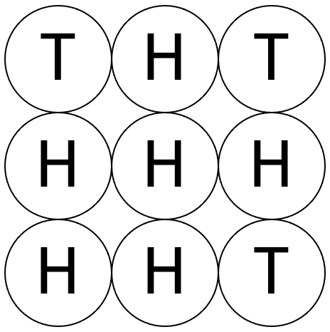
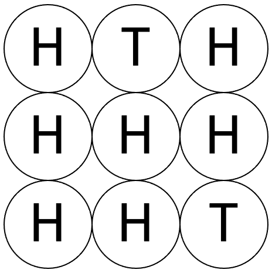

# 2582: 동전 뒤집기 2

|시간 제한|메모리 제한|
|--------|----------|
|1 초|128 MB|

## 문제
N^2개의 동전이 N행 N열을 이루어 탁자 위에 놓여 있다. 그 중 일부는 앞면(H)이 위를 향하도록 놓여 있고, 나머지는 뒷면(T)이 위를 향하도록 놓여 있다. <그림 1>은 N이 3일 때의 예이다.

||
|--------|
|<그림 1>|

이들 N^2개의 동전에 대하여 임의의 한 행 또는 한 열에 놓인 N개의 동전을 모두 뒤집는 작업을 수행할 수 있다. 예를 들어 <그림 1>의 상태에서 첫 번째 열에 놓인 동전을 모두 뒤집으면 <그림 2>와 같이 되고, <그림 2>의 상태에서 첫 번째 행에 놓인 동전을 모두 뒤집으면 <그림 3>과 같이 된다.

|||
|--------|--------|
|<그림 2>|<그림 3>|

<그림 3>의 상태에서 뒷면이 위를 향하여 놓인 동전의 개수는 두 개이다. <그림 1>의 상태에서 이와 같이 한 행 또는 한 열에 놓인 N개의 동전을 모두 뒤집는 작업을 계속 수행할 때 뒷면이 위를 향하도록 놓인 동전의 개수를 2개보다 작게 만들 수는 없다.

N^2개의 동전들의 초기 상태가 주어질 때, 한 행 또는 한 열에 놓인 N개의 동전을 모두 뒤집는 작업들을 수행하여 뒷면이 위를 향하는 동전 개수를 최소로 하려 한다. 이때의 최소 개수를 구하는 프로그램을 작성하시오.

## 입력
첫째 줄에 32 이하의 자연수 N이 주어진다. 둘째 줄부터 N줄에 걸쳐 N개씩 동전들의 초기 상태가 주어진다. 각 줄에는 한 행에 놓인 N개의 동전의 상태가 왼쪽부터 차례대로 주어지는데, 앞면이 위를 향하도록 놓인 경우 H, 뒤면이 위를 향하도록 놓인 경우 T로 표시되며 이들 사이에 공백은 없다.

## 출력
첫째 줄에 한 행 또는 한 열에 놓이 N개의 동전을 모두 뒤집는 작업들을 수행하여 뒷면이 위를 향하여 놓일 수 있는 동전의 최소 개수를 출력한다.

## 예제
### 예제 입력 1
```
3
HHT
THH
THT
```
### 예제 출력 1
```
2
```
